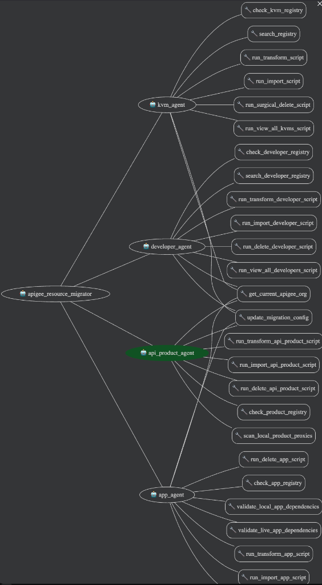

# 🚀 Apigee Resource Migration Agent

An advanced multi-agent system built on Google's **Agent Development Kit (ADK)** to orchestrate and execute complex migrations of Apigee resources. This agent acts as an intelligent co-pilot for migration engineers, simplifying the transition of Key Value Maps (KVMs), Developer profiles, API Products, and Developer Apps between organizations (especially from OPDK to Apigee X/Hybrid) with a focus on safety, auditability, and automation.

---

## 🧠 System Architecture

The project employs a hub-and-spoke multi-agent architecture, ensuring a clean separation of concerns and highly focused interactions.



### 👑 Root Agent: `apigee_resource_migrator`
The central entry point and orchestrator. It understands user intent, explains capabilities, and routes requests to the appropriate specialized sub-agent.
*   **Behavior:** Strictly a router. It delegates all heavy lifting to sub-agents to minimize context bloat and improve response accuracy.

### 🕵️‍♂️ Specialized Sub-Agents

1.  **📦 KVM Agent (`kvm_agent`)**
    *   Handles all operations related to Key Value Maps.
    *   Manages the transformation of source `.tgz` files.
    *   Performs imports and live audits.

2.  **👥 Developer Agent (`developer_agent`)**
    *   Specializes in App Developer profiles.
    *   Transforms profile data and imports it to the target organization.
    *   Tracks imported resources in a local registry.

3.  **🛍️ API Product Agent (`api_product_agent`)**
    *   Manages the migration of API Products.
    *   Features dependency scanning to ensure required API proxies exist before import.

4.  **📱 App Agent (`app_agent`)**
    *   The most complex agent, handling Developer Applications.
    *   Implements a two-stage dependency-aware import process.
    *   Cleans up duplicate or auto-generated credentials.

---

## 🛠 Detailed Capabilities Matrix

| Resource Type | 🔄 Transform | 📥 Import | 🔍 View / Audit | 🗑 Delete | 🌟 Special Capabilities |
| :--- | :---: | :---: | :---: | :---: | :--- |
| **Key Value Maps (KVM)** | ✅ | ✅ | ✅ | ✅ | Registry-based pre-flight checks to prevent accidental deletion. |
| **Developers** | ✅ | ✅ | ✅ | ✅ | Live data fetching from Apigee to compare with local state. |
| **API Products** | ✅ | ✅ | ➖ | ✅ | Scans local products to identify required API proxies. |
| **Developer Apps** | ✅ | ✅ | ➖ | ✅ | Two-stage validation (checks for live Developers and Products). |

*Key: ✅ Supported | ➖ Not applicable/Not implemented*

---

## 🛡 Safety & Guardrails

Migration operations can be destructive. This system implements strict guardrails:

*   **Registry-Based Deletions:** The deletion agents (KVM and Developer) verify resources against a local registry of *previously imported* items before attempting deletion. This prevents accidental removal of pre-existing resources.
*   **Human-in-the-Loop (HITL):** Destructive actions and high-risk imports require explicit user confirmation in the chat before the execution tools will fire.
*   **Dependency Validation:** The App Agent will refuse to import apps if the required Developers or API Products are missing from the target organization.

---

## 📁 Project Structure

```text
7-apigee-resorce-migration-agent/
├── manager/                  # Core Agent Application & Scripts
│   ├── agent.py             # Defines Root Agent
│   ├── sub_agents/          # Specialized Agent Definitions
│   │   ├── kvm/
│   │   ├── developer/
│   │   ├── api_product/
│   │   └── app/
│   ├── tools/               # ADK Tools wrapping execution scripts
│   ├── scripts/             # Low-level Python migration scripts
│   └── registry-log/        # Local registry logs tracking imports
└── README.md
```

## 🌟 Key Features

*   **Automated Transformation:** Converts resource definitions from source format to target-compatible JSON.
*   **Smart Skip Logic:** Avoids redundant work by skipping resources that already exist and match the target state.
*   **Dependency Resolution:** Ensures prerequisites are met (e.g., valid developers and products exist before creating apps).
*   **Auditable Logs:** Every run generates detailed logs in `manager/scripts/run_logs/`.

## ⚙️ How It Works

1.  **Conversation:** The user interacts with the Root Agent via the ADK Web UI, stating their migration goal.
2.  **Delegation:** The Root Agent identifies the resource type and invokes the corresponding specialized sub-agent.
3.  **Execution:** The sub-agent prompts for necessary inputs (e.g., source directory, org name) and calls the appropriate ADK Tool.
4.  **Script Execution:** The ADK Tool executes a low-level Python script (located in `manager/scripts/`) that interacts with Apigee APIs using `gcloud` and `apigeecli`.
5.  **Feedback:** Results are parsed and returned to the user in a clean summary format.

## ⏩ Easing OPDK to Apigee X Migration

Migrating from Apigee OPDK (On-Premises) to Apigee X/Hybrid traditionally involves significant manual effort and risk of human error. This agent eases the process by:
*   **Handling API Differences:** It abstracts away the differences in API surfaces between OPDK and X.
*   **Safe Rollbacks:** If an import fails halfway, the agent can use the local registry to surgically clean up only the resources it created, leaving pre-existing data untouched.
*   **Validation Guardrails:** It prevents broken references by checking that dependent resources actually exist in the live target environment before proceeding.

---

## 🚀 Getting Started

### Prerequisites
*   Python environment activated (usually handled in the parent directory).
*   `gcloud` CLI installed and configured for authentication.
*   `apigeecli` installed and available in the path.

### Steps to Run

1.  **Activate the Environment:**
    ```bash
    source ../.venv/bin/activate
    ```
2.  **Configure Environment:** Ensure `manager/.env` contains your `GOOGLE_API_KEY` (and other required variables).
3.  **Start the Agent Web Server:**
    ```bash
    adk web --port=9092
    ```
4.  Open the URL provided in the output (e.g., `http://localhost:9092`) and select the `apigee_resource_migrator` agent to begin.
